  

<h3 align="center">
  
</h3>

  
  
  

### ⚡ What I Do

`Products` · `SaaS` · `CRM / ERP` · `AI Tools` · `3D Web` · `Automation`

---

<table align="center">
<tr>
<td width="33%" align="center">

**🌿 GardenQR**
Interactive 3D QR experiences
Three.js · GSAP

</td>
<td width="33%" align="center">

**🏢 Clarity ERP**
Full-stack CRM / ERP platform
Architecture · Ops

</td>
<td width="33%" align="center">

**🧠 Let's Learn**
AI learning platform
RAG · Local AI

</td>
</tr>
<tr>
<td colspan="3" align="center">

**🔌 Miro MCP** — Miro → context for AI coding agents

</td>
</tr>
</table>

---

### 🛠️ Stack

Also: FastAPI · Django · GSAP · FFmpeg · Whisper · MCP · Shopify · Medusa · ChromaDB

  
  

  <i>Build useful things. Ship them.</i> 🚀

